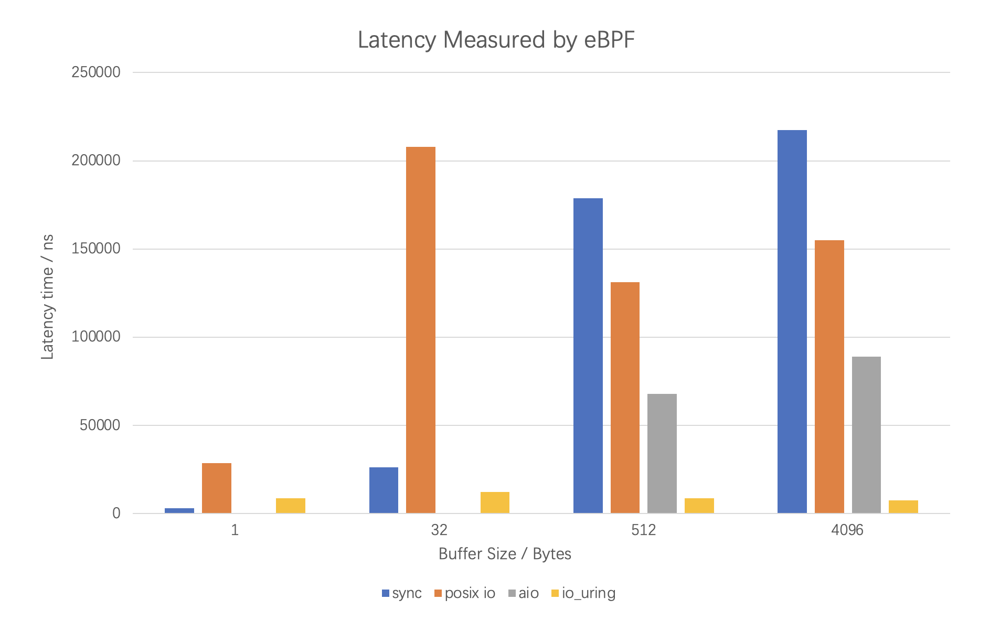

## TestIO-Naïve

> CS2952 Homework : A project to test performance differences of different asynchronous I/O
>
> The target I/O library : sync, native aio, posix io and io_uring

### Environment

1. BPF Compiler Collection([BCC](https://github.com/iovisor/bcc))

   Install from source code. See tutorial [here](https://github.com/iovisor/bcc/blob/master/INSTALL.md#ubuntu---source)

   And enable USDT

   ```shell
   $ sudo apt-get install systemtap-sdt-dev
   ```

2. Flexible I/O Tester([fio](https://github.com/axboe/fio))

   See tutorial [here](https://github.com/axboe/fio#building)

3. Flame Graph and perf

   For detailed usage : [here](https://zhuanlan.zhihu.com/p/402188023)

   ```shell
   $ git clone https://github.com/brendangregg/FlameGraph
   $ sudo apt install linux-tools-common
   ```

4. Install IO library

   ``` shell
   $ sudo apt-get install libaio-dev
   $ git clone https://github.com/axboe/liburing.git
   $ cd liburing && make && make all
   $ sudo cp -r ../liburing /usr/share
   $ sudo cp src/liburing.so.2.2 /usr/lib/x86_64-linux-gnu/liburing.so
   $ sudo cp src/liburing.so.2.2 /usr/lib/x86_64-linux-gnu/liburing.so.2
   ```

### Method

We focus on the **latency** and **IOPS** (I/O Operations Per Second) performance of I/O library(sync, native aio, posix io and io_uring) which may be two main dimensions that people are concerned about. And all tests are done with flag **O_DIRECT** in order to avoid cache interference except small read/write operations imitating **zero-delay** cases.

1. Latency

   **BCC** is used to write eBPF tracing program to detect the running time of specific kernel functions, user functions and code segments. Namely **uprobe** and **uretprobe** are used to catch I/O library functions. **USDT** are defined to trace specific code segments. For example : (code in `src/bpfCode.c` and `src/test.py`)

   ```python
   b.attach_uprobe(name="uring", sym="io_uring_submit", fn_name="bpf_iouring_submit_in")
   b.attach_uretprobe(name="uring", sym="io_uring_submit", fn_name="bpf_iouring_submit_out")
   ```

2. Throughput(IOPS)

   **Fio** is used to perform pressure testing on different I/O library. We control the parameters to implement the comparison experiment. The detailed instruction is in `res/bench.md`. The sample is below : 

   ```shell
   dreamer@ubuntu:~/Desktop/try/bench$ fio -thread -size=1G -bs=4k -direct=1 -rw=randwrite -name=test -group_reporting -filename=./io.tmp -runtime 600 --ioengine=io_uring --iodepth=128
   ```

3. Call Stack Analysis

   We use **perf** and **FlameGraph** to generate the flame graph of the procedure. 

   ```shell
   $ sudo perf record -F 99 -p `pid of test program` -g -- sleep 30
   $ sudo perf script -i perf.data &> perf.unfold
   $ sudo ./FlameGraph/stackcollapse-perf.pl perf.unfold &> perf.folded
   $ sudo ./FlameGraph/flamegraph.pl perf.folded > perf.svg
   ```

   And the sample graph is like :

   

### Analysis

> The following are personal opinions, which maybe a little naive.

#### Throughput

Assuming the bottom block device has a constant and robust read/write speed $v$, then the maximal realistic work over a period of time $t$ is $w_{nax} = v\times t$. However, $w_{max}$ can be accessed only under ideal circumstances. The reality is device dominated by driver, which is part of linux kernel. For generalization, concurrency and security, abstraction layer like VFS exists in kernel, which induces extra cost for maintaining such a system. So the real work over $t$ is $w=v\times(t-t')=w_{max}-c$. To improve the throughput of the device is equivalent to **decrease the cost** $c$. 

For sync I/O, we can simply construct the cost model as a **linear** $O(n)$ one because each sync I/O operation need two syscalls (words in detail, whether the interrupt-driven I/O or busy-waiting I/O both has cost).

So a natural intuition is utilizing one syscall (or something has cost) for a batch of I/O operations, which converts the linear $O(n)$ cost model to a approximate constant $O(1)$ one. That's the property which asynchronous I/O owns. Posix I/O, native AI/O and IO_uring are all able to submit or harvest a batch of I/O requests once. So they have better performance on throughput.

The reason why $io\_uring\approx aio\gt posix\_io$ is that the cost of **context switching** in posix I/O implementation is much greater than the cost of syscall like `io_submit` or `io_uring_enter`, which means larger coefficient in $O(1)$. An extreme case of this intuition is **IORING_SETUP_SQPOLL** mode io_uring, where plenty of operations are submitted and then harvested **without** a single syscall. This is done by a radical thread in kernel frequently check the shared memory area **SQE** and **CQE** between user and kernel. The cost model of this case is something like $O(0)$ (while in fact it still has small cost).

Theoretical analysis shows $io\_uring(SQPOLL)\gt io\_uring\approx aio\gt posix\_io\gt sync$. And the experiment result is below : 


#### Latency

The original target for designing asynchronous architecture is to avoid blocking, which is expensive when device gets faster and programs gets more complex. CPU is released to undertake other meaningful work. So non-blocking is an essential way for I/O operation.  There are many ways to implement non-blocking. Posix I/O uses **thread pools** to initialize set of helper threads. The main thread dispatches the I/O requests to many helper threads which will block to carry on the operations while the main thread get non-blocking function call. However, there is no pie in the sky. The cost of doing this is the mess of concurrency (like IPC or shared resources) and context switching. So the actual improvement is not significant with unbearable bugs introduced.

Another way to implement non-blocking I/O is like io_uring. The essence of the approach is to leave some of the work to the io_uring module in the kernel to avoid syscalls by setting a `io_uring context` with shared memory. The shared memory area consists of **SQE** and **CQE** which are two circular queue (in other word, **single producer single consumer**) to transfer information between user and kernel without risk of compete race. The user thread just put the I/O request on the free entry of **SQE** and then either the kernel io_uring is notified or the kernel io_uring is radical to find it (case in SQPOLL).

Theoretical analysis shows $io\_uring\approx aio\gt posix\_io\gt sync$. And the experiment result is below : 

> Something wrong with my aio library leading to high latency in this case



We can find that the experiment fits well with the theoretical analysis when the amount of data is large. But when the buffer size is smaller, the sync I/O get smaller latency. That is because under the case of hot cache hit or small read/write operations the real operation cost is small enough to catch up the cost of asynchronous operations. Under this circumstance, the sync is better.

#### Call Stack

// todo :

### Reference

1. [io_uring manpage](https://unixism.net/loti/index.html#)

2. [Blog of io_uring](https://thenewstack.io/how-io_uring-and-ebpf-will-revolutionize-programming-in-linux)

3. [Another blog of io_uring](https://zhuanlan.zhihu.com/p/380726590)

4. [bcc repo](https://github.com/iovisor/bcc/blob/master/docs/tutorial_bcc_python_developer.md)